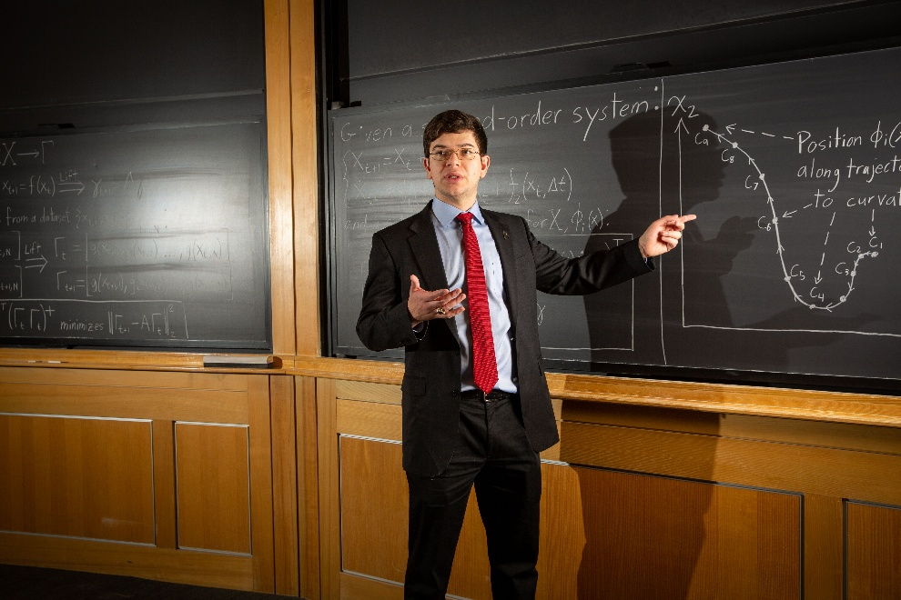

I am recently earned my Ph.D. in
Mechanical Engineering, with a Minor in Applied Mathematics, from MIT,
working with Professor H. Harry Asada at the [d'Arbeloff Laboratory](https://darbelofflab.mit.edu/). I
previously earned my S.M. and S.B. from MIT as well, with my S.M. work
done with Prof. Asada in the d'Arbeloff Lab, and my S.B. work done with
Professor Marija Ilić and Chris Smith at [MIT Lincoln Laboratory](https://www.ll.mit.edu/r-d/homeland-protection/energy-systems).

I am a roboticist and mechanical engineer with expertise in dynamic
systems modeling\[L\], advanced actuator design\[L\], and real-time
control algorithms\[L\]. My passion is bridging mechanical design\[L\]
with cutting-edge modeling approaches, such as predictive modeling for
human-robot interaction systems\[L\]. I am an experienced engineering
collaborator, having demonstrated effectiveness in leading
multidisciplinary teams\[L,L\] and in teaching complex engineering
concepts\[L\].

[Google Scholar](https://scholar.google.com/citations?user=qO-KEPQAAAAJ) \| [LinkedIn](https://www.linkedin.com/in/jhbell4/) \| [Email](mailto:jhbell@mit.edu)

